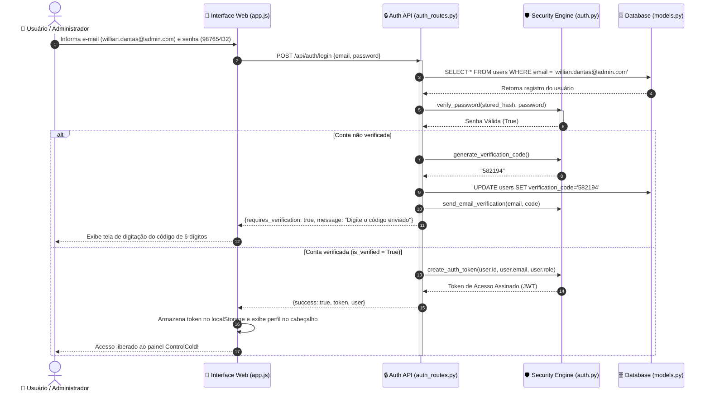
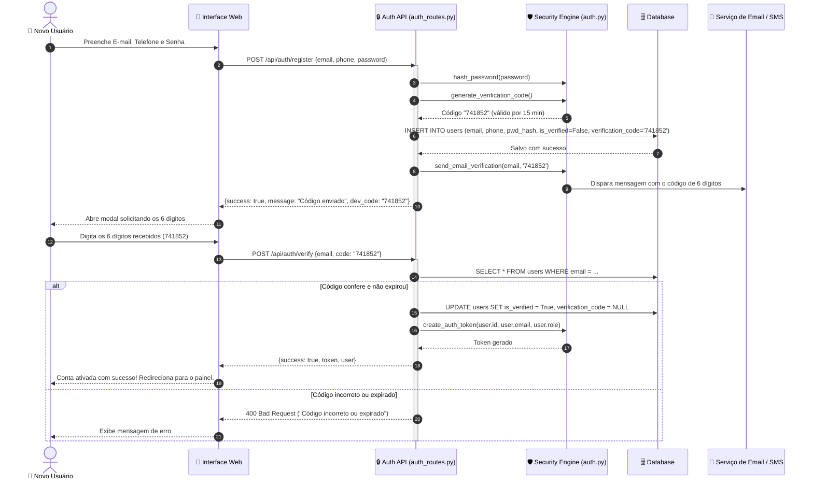
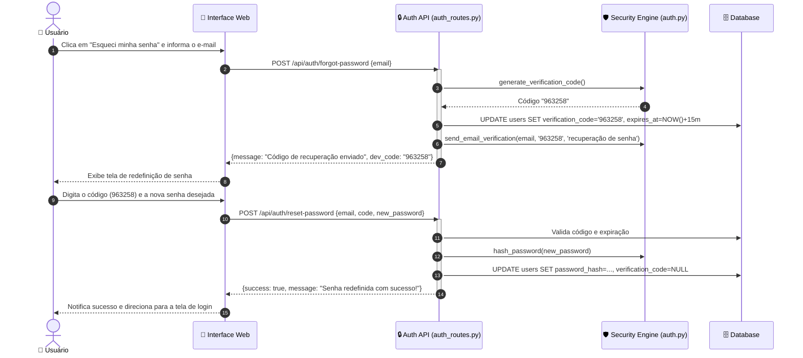
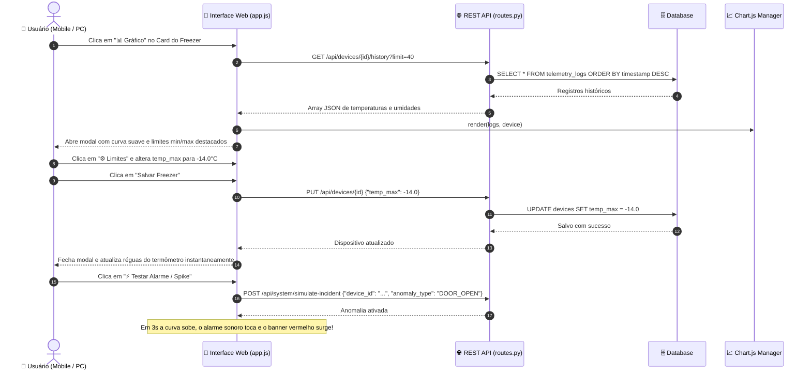

# 📊 Diagrama de Sequência e Arquitetura - ControlCold

Este documento detalha o funcionamento interno de ponta a ponta do sistema **ControlCold**, demonstrando a camada de segurança e controle de acesso (login, cadastro com código de 6 dígitos, recuperação de senha) e o ciclo de vida dos dados de telemetria IoT.

---

## 🗺️ Visão Geral dos Módulos Envolvidos

1. **Camada de Segurança (`auth.py` / `auth_routes.py`)**: Autenticação, hash criptográfico PBKDF2, tokens assinados e motor de código de 6 dígitos.
2. **Hardware / Simulador**: Sensores Ekaza/Tuya ou Simulador Termodinâmico.
3. **Coletor de Telemetria (`tuya_client.py` / `simulator.py`)**: Realiza requisições LAN/Cloud ou gera medições físicas.
4. **Motor de Regras (`evaluator.py`)**: Analisa desvios de temperatura, histerese e supressão de alarmes.
5. **Banco de Dados Assíncrono (`db.py` / SQLite / PostgreSQL)**: Registra usuários, dispositivos, histórico de medições e incidentes.
6. **Central de Alertas (`telegram_bot.py`)**: Formata e envia mensagens para o smartphone dos operadores.
7. **Hub WebSocket & API REST (`websocket.py` / `routes.py`)**: Transmite dados ao vivo e responde requisições do frontend.
8. **Frontend Web (`index.html` / `app.js` / `socket.js` / `charts.js`)**: Renderiza visualizações táteis em smartphones e painel executivo em PCs.

---

## 1. 🔐 Fluxo de Autenticação e Login Seguro

Demonstra o acesso do administrador mestre (`willian.dantas@admin.com` / `98765432`) e operadores:



---

## 2. 📨 Fluxo de Cadastro com Verificação em 2 Etapas (Código de 6 Dígitos)

Todo novo usuário cadastrado com e-mail ou telefone deve obrigatoriamente confirmar o código recebido:



---

## 3. 🔑 Fluxo de Recuperação e Redefinição de Senha

Processo seguro para redefinir senha sem expor credenciais:



---

## 4. 🔄 Fluxo de Inicialização do Sistema (Startup & Lifespan)

Quando o servidor é iniciado, ele prepara as tabelas, cadastra o administrador e inicia o monitoramento térmico:

```mermaid
sequenceDiagram
    autonumber
    actor Operador as 👤 Operador / Sistema
    participant Main as 🚀 backend/main.py
    participant DB as 🗄️ Database (SQLite/Postgres)
    participant SeedAdmin as 👑 Seeder Administrador
    participant SeedDev as 🌱 Seeder Freezers
    participant Loop as ⏱️ Background Telemetry Loop

    Operador->>Main: Inicia servidor (uvicorn main:app)
    activate Main
    Main->>DB: init_db() -> Cria tabelas (users, devices, telemetry_logs, alarm_events)
    DB-->>Main: Tabelas verificadas/prontas
    
    Main->>SeedAdmin: seed_admin_user()
    activate SeedAdmin
    SeedAdmin->>DB: Verifica willian.dantas@admin.com
    alt Se administrador não existir
        SeedAdmin->>DB: INSERT administrador com senha criptografada 98765432
        DB-->>SeedAdmin: Administrador criado
    end
    deactivate SeedAdmin

    Main->>SeedDev: seed_initial_devices_if_empty()
    activate SeedDev
    SeedDev->>DB: SELECT COUNT(*) FROM devices
    alt Se banco de freezers estiver vazio
        SeedDev->>DB: INSERT freezers padrão (Sorvetes, Carnes, Laticínios, Vacinas)
        DB-->>SeedDev: Freezers cadastrados
    end
    deactivate SeedDev

    Main->>Loop: asyncio.create_task(telemetry_collection_loop())
    activate Loop
    Main-->>Operador: Servidor pronto na porta 8000 (HTTP + WebSocket)
    deactivate Main
```

---

## 5. 📡 Fluxo de Coleta Periódica e Telemetria em Tempo Real

A cada **3 segundos**, o loop em segundo plano consulta os equipamentos, processa as leituras e transmite para os navegadores conectados:

```mermaid
sequenceDiagram
    autonumber
    participant Loop as ⏱️ Background Loop (main.py)
    participant DB as 🗄️ Database (db.py)
    participant Tuya as 🔌 TuyaClient (tuya_client.py)
    participant Sim as 🧪 TelemetrySimulator (simulator.py)
    participant Rules as 🧠 RulesEngine (evaluator.py)
    participant WS as ⚡ WebSocket Manager
    participant Frontend as 📱 Frontend ControlCold (Mobile/PC)

    loop A cada 3 segundos
        Loop->>DB: SELECT * FROM devices WHERE is_active = True
        DB-->>Loop: Lista de freezers cadastrados
        
        loop Para cada Freezer
            alt Se Tuya Cloud/LAN estiver configurado
                Loop->>Tuya: read_device_local() ou get_device_status()
                Tuya-->>Loop: {temp, hum, battery}
            else Modo Simulação Ativo (Fallback)
                Loop->>Sim: generate_reading(device_config)
                Sim-->>Loop: {temp, hum, battery}
            end

            Loop->>Rules: evaluate(device, temp, temp_min, temp_max, battery)
            Rules-->>Loop: (status, new_alarms, resolved_alarms)

            Loop->>DB: INSERT TelemetryLog & UPDATE Device (current_temp, status)
            DB-->>Loop: Persistido

            Loop->>WS: broadcast("TELEMETRY_UPDATE", payload)
            WS-->>Frontend: Envia atualização via WebSocket sem recarregar a tela
            Frontend->>Frontend: Atualiza dígitos gigantes, barra do termômetro e gráfico
        end
    end
```

---

## 6. 🚨 Fluxo de Detecção de Violação Térmica e Disparo de Alarme

Caso um freezer ultrapasse a temperatura limite (ex: porta esquecida aberta ou compressor desligado):

```mermaid
sequenceDiagram
    autonumber
    participant Loop as ⏱️ Background Loop
    participant Rules as 🧠 RulesEngine (evaluator.py)
    participant DB as 🗄️ Database
    participant Telegram as ✈️ TelegramNotifier
    participant WS as ⚡ WebSocket Manager
    participant Frontend as 📱 Frontend (Navegador)
    actor Operador as 👤 Operador

    Note over Loop,Rules: Temperatura sobe para -13.5°C (Limite Máx: -15.0°C)
    Loop->>Rules: evaluate(temp=-13.5, temp_max=-15.0)
    activate Rules
    Rules->>Rules: Detecta violação: status = CRITICO
    Rules->>Rules: Verifica se alarme TEMP_HIGH já está ativo (Anti-Spam)
    Rules-->>Loop: Retorna new_alarms=[{device, severity: CRITICAL, message: "🚨..."}]
    deactivate Rules

    Loop->>DB: INSERT AlarmEvent (status: ACTIVE)
    
    par Notificação no Smartphone (Telegram)
        Loop->>Telegram: send_alarm(alarm_data)
        Telegram->>Operador: Mensagem Push com emoji 🚨, equipamento, medição e limites
    and Transmissão ao Vivo aos Navegadores
        Loop->>WS: broadcast("NEW_ALARM", alarm_data)
        WS-->>Frontend: Mensagem WebSocket do tipo NEW_ALARM
        Frontend->>Frontend: 1. Aciona sintetizador sonoro Web Audio (Bipe de Alarme)
        Frontend->>Frontend: 2. Exibe faixa vermelha pulsante no topo da tela
        Frontend->>Frontend: 3. Adiciona linha na tabela de ocorrências recentes
    end
```

---

## 7. ✅ Fluxo de Normalização da Temperatura (Resolução do Incidente)

Quando a porta do freezer é fechada e o compressor restabelece a temperatura segura:

```mermaid
sequenceDiagram
    autonumber
    participant Loop as ⏱️ Background Loop
    participant Rules as 🧠 RulesEngine (evaluator.py)
    participant DB as 🗄️ Database
    participant Telegram as ✈️ TelegramNotifier
    participant WS as ⚡ WebSocket Manager
    participant Frontend as 📱 Frontend

    Note over Loop,Rules: Temperatura desce para -18.2°C (Faixa Segura: -22 a -15°C)
    Loop->>Rules: evaluate(temp=-18.2)
    activate Rules
    Rules->>Rules: Identifica que alarme TEMP_HIGH foi sanado
    Rules-->>Loop: resolved_alarms=["TEMP_HIGH"], status = NORMAL
    deactivate Rules

    Loop->>DB: UPDATE AlarmEvent SET status='RESOLVED', resolved_at=NOW()
    
    par Encerramento no Telegram
        Loop->>Telegram: send_resolution(device_name, current_temp)
        Telegram-->>Operador: Notificação: "✅ [RESOLVIDO] Temperatura Normalizada"
    and Encerramento no Frontend
        Loop->>WS: broadcast("ALARM_RESOLVED", payload)
        WS-->>Frontend: Remove faixa crítica e atualiza badge para NORMAL
    end
```

---

## 8. 👆 Fluxo de Interação do Usuário (Frontend Mobile & Desktop)

Como as interações na interface (ajuste de limites, visualização de gráfico e testes) são processadas:



---

## 📑 Resumo dos Protocolos e Portas

| Comunicação | Protocolo | Origem | Destino | Finalidade |
| :--- | :--- | :--- | :--- | :--- |
| **Autenticação** | HTTPS REST (PBKDF2/Tokens) | Frontend | `/api/auth/*` | Login, registro, 6 dígitos e recuperação |
| **Leitura Local** | UDP/TCP (Tuya 3.3/3.4) | Backend | Sensor / Gateway Ekaza | Leitura direta sem internet |
| **Nuvem Tuya** | HTTPS REST (HMAC-SHA256) | Backend | `openapi.tuyaus.com` | Leitura via Tuya Developer Cloud |
| **Streaming Web** | WebSocket (`ws://`) | Frontend | `backend/ws/live` | Atualização instantânea a cada 3s |
| **API REST** | HTTP (`http://`) | Frontend | `backend/api/*` | CRUD, histórico, limites e overview |
| **Alertas Push** | HTTPS REST | Backend | `api.telegram.org` | Envio de mensagens e avisos críticos |
| **Confirmação Email**| SMTP / TLS (Porta 587) | Backend | Provedor de Email | Envio de código de 6 dígitos |
